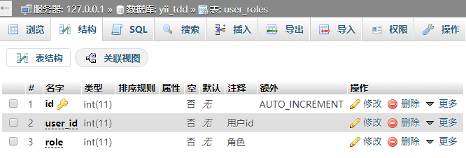
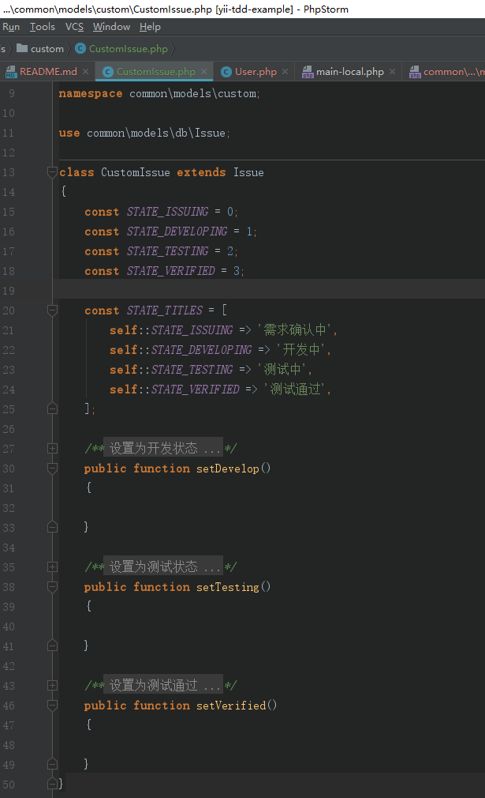
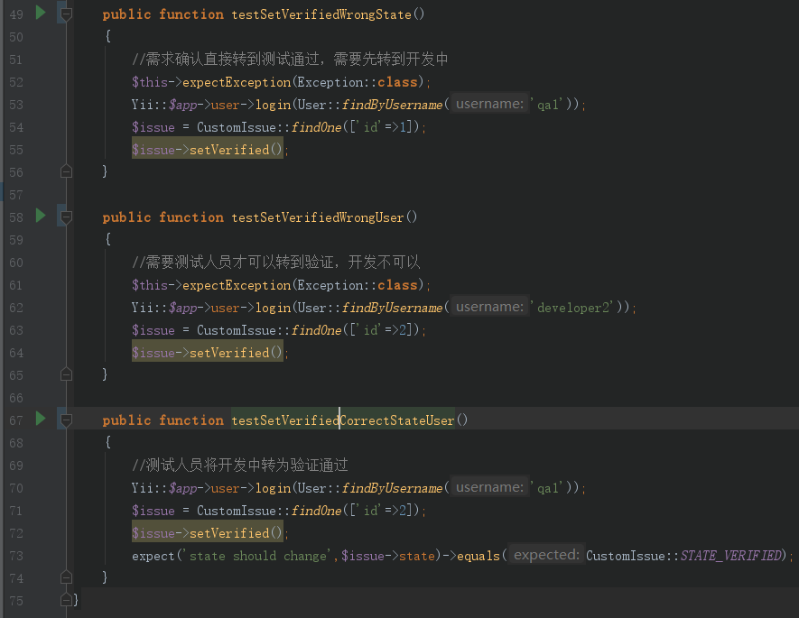

# yii2 测试驱动开发示例

在我们管理团队开发的时候总是很难控制每个个体的产出质量，TDD可能是一种解决方案

## 假设场景

我们有一个项目，其中工作流状态控制比较复杂想要引入TDD来保证质量，工作流遵循

创建需求=`需求确认中` -> `开发中` <-> `测试中` -> `测试通过`

其中只有`开发人员`可以将`需求确认中`阶段的转换为`开发中`，只有`测试人员`可以将`测试中`阶段转换为`开发中`或`测试通过`

## 环境准备

创建项目

初始化项目

创建数据库和表

配置db，注意同样调整 `test-local.php`

初始化user

生成model（同理生成user_role的）

准备代码骨架

## 写测试

单元测试源码 [common/tests/unit/models/custom/CustomIssueTest.php](./common/tests/unit/models/custom/CustomIssueTest.php)

当然还要使用fixture准备一些mock环境，官方参考 https://www.yiiframework.com/doc/guide/2.0/zh-cn/test-fixtures

- [common/tests/unit/models/custom/CustomIssueTest.php](./common/tests/unit/models/custom/CustomIssueTest.php) 中的 `public function _fixtures()`
- [common/fixtures/IssueFixture.php](./common/fixtures/IssueFixture.php) 
- [common/fixtures/UserRolesFixture.php](./common/fixtures/UserRolesFixture.php)
- [common/tests/_data/custom_issue_issues.php](./common/tests/_data/custom_issue_issues.php)
- [common/tests/_data/custom_issue_user_roles.php](./common/tests/_data/custom_issue_user_roles.php)
- [common/tests/_data/custom_issue_users.php](./common/tests/_data/custom_issue_users.php)

现在运行应该是全失败的

 
 
 
 
 ## 开发代码
 
 现在只要测试通过了，我的开发就算完成
 
 ### `function setVerified()`
 
 [common/models/custom/CustomIssue.php](./common/models/custom/CustomIssue.php)
 
 
 
 
 ## 最后
 
 例子仅限于演示TDD开发流程，不代表最佳实践（例如数据表使用migration管理更合理，用户角色使用RBAC等）
 
 
 