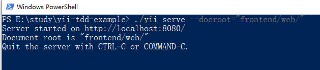

# yii2 测试驱动开发示例 | TDD example for yii2

quick glance: https://www.youtube.com/watch?v=GdVmYISOqA8&list=PLM1v95K5B1ntVsYvNJIxgRPppngrO_X4s

## 环境准备

创建项目 | create project

初始化项目 | init project

创建数据库和表 | create tables

配置db，注意同样调整 `test-local.php` | config db, don't forget `test-local.php`

初始化 user | initiallize user

生成model（同理生成user_role的）| generate models

准备代码骨架 | code skeleton

## 写测试 | write tests

单元测试源码 | test codes [common/tests/unit/models/custom/CustomIssueTest.php](./common/tests/unit/models/custom/CustomIssueTest.php)

当然还要使用fixture准备一些mock环境，官方参考 | use fixture for mocking, refer https://www.yiiframework.com/doc/guide/2.0/zh-cn/test-fixtures

- [common/tests/unit/models/custom/CustomIssueTest.php](./common/tests/unit/models/custom/CustomIssueTest.php) 中的 `public function _fixtures()`
- [common/fixtures/IssueFixture.php](./common/fixtures/IssueFixture.php) 
- [common/fixtures/UserRolesFixture.php](./common/fixtures/UserRolesFixture.php)
- [common/tests/_data/custom_issue_issues.php](./common/tests/_data/custom_issue_issues.php)
- [common/tests/_data/custom_issue_user_roles.php](./common/tests/_data/custom_issue_user_roles.php)
- [common/tests/_data/custom_issue_users.php](./common/tests/_data/custom_issue_users.php)

现在运行应该是全失败的 | for now all should fail

 
 
 
 
 ## 开发代码 | develop features
 
 现在只要测试通过了，我的开发就算完成 | when the tests pass, our issues are done
 
 ### `function setVerified()`
 
 [common/models/custom/CustomIssue.php](./common/models/custom/CustomIssue.php)
 
 
 
 
 ## 最后 | PS
 
 例子仅限于演示TDD开发流程，不代表最佳实践（例如数据表使用migration管理更合理，用户角色使用RBAC等） | this project is only showing how to adopt TDD, doest not represent best practices in yii2 (things like using migration is better than raw mysql operation)
 
 
 
